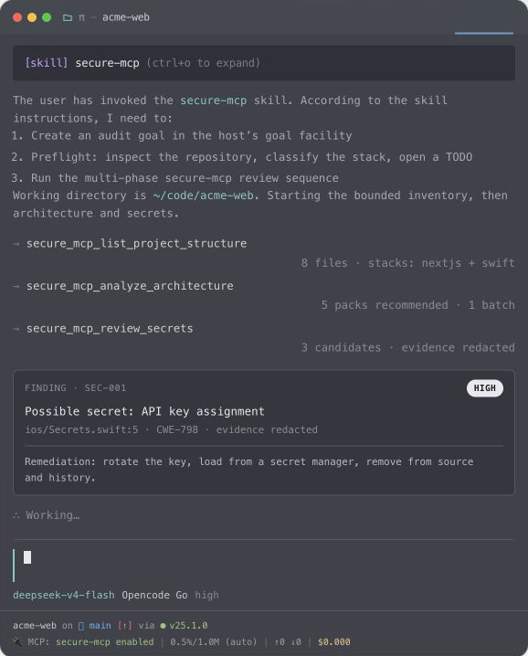

# secure-mcp

[](https://github.com/brbndon/secure-mcp/actions/workflows/ci.yml)
[](https://www.npmjs.com/package/@brdndon/secure-mcp)
[](LICENSE)

Local **Model Context Protocol (MCP)** server that helps coding agents run defensive, remediation-focused secure code review of source repositories.



- Protocol: MCP revision `2026-07-28` only (strict v2, stdio). Clients that cannot negotiate this protocol revision will not connect.
- Focus: TypeScript / Next.js, Swift / SwiftUI, and Expo / React Native
- Transport: stdio only, running as a local subprocess of the agent client
- License: [Apache-2.0](LICENSE)
- Framing: identify potential weaknesses, classify them by CWE, severity, and confidence, then recommend concrete remediation. This is not an offensive toolkit.

## Why this exists

Rule-based scanners are useful, but agents still need:

- Portable, agent-first tools that work across Codex, Claude, Cursor, pi, and similar clients
- Structured findings with required remediation fields for multi-phase workflows
- Stack awareness beyond generic SAST, especially for modern Swift and Next.js App Router patterns
- Remediation-oriented threat modeling, not only regex hits

`secure-mcp` is an open-source implementation of that workflow.

## Features

| Tool | Purpose |
| --- | --- |
| `secure_mcp_list_project_structure` | Inventory for review scoping |
| `secure_mcp_analyze_architecture` | Stacks, trust boundaries, `recommended_packs`, and `pack_batches` |
| `secure_mcp_get_knowledge_pack` | On-demand stack checklists (maximum six packs per call) |
| `secure_mcp_get_audit_guidance` | Detailed agent workflow and guardrails on demand |
| `secure_mcp_check_authentication` | Authentication and authorization weaknesses to remediate |
| `secure_mcp_analyze_injection_risks` | Injection-class risks to remediate |
| `secure_mcp_review_secrets` | Secret hygiene, rotation, and remediation |
| `secure_mcp_build_remediation_threat_model` | STRIDE fragments for hardening priorities |
| `secure_mcp_produce_findings` | Deduplicated, prioritized remediation report |
| `secure_mcp_list_authorized_roots` | List allowlisted roots and whether each exists |
| `secure_mcp_list_projects` | Depth-capped discovery of package-manifest project roots |
| `secure_mcp_run_local_scanners` | Optional, default-off compose of local `semgrep`/`gitleaks` |

All tools are read-only, never execute project code, and respect ignore patterns and size caps. Bounded audit tools return structured `coverage` with reviewed and excluded paths, ignore reasons, caps, truncation, and candidate dispositions. An empty finding list is not a claim that the entire tree was scanned.

`focus_paths` accepts relative path prefixes for scoped drill-down on repository, architecture, and category tools. Omit it for a whole-repository review.

### Finding structure

Every finding follows the same shape:

1. `evidence`
2. `classification` (severity, confidence, category, optional CWE)
3. `impact_if_unremediated`
4. `remediation`
5. `residual_risk` and `verification_suggestion`

Findings can also include stable traceability fields such as `rule_family`, `root_control`, `instance_id`, `source`, `control`, `sink`, `counterevidence`, `proof_gap`, `validation`, and candidate `disposition`.

## Requirements

- Git
- Node.js 20 or newer
- pnpm 10 for the clone + build + installer path
- Bash and Python 3 for `scripts/install-agents.sh`; PowerShell 7 for `scripts/install-agents.ps1`
- One or more existing absolute directories the server is allowed to inspect (`SECURE_MCP_ALLOWED_ROOTS`)
- An MCP client that supports protocol revision `2026-07-28`

## Quick start (recommended): clone + setup script

The primary path is a git checkout. That is what ships the **agent skill**, the **installer**, fixtures, source, and documentation. npm only provides the server binary as a last resort (see [Server-only via npm](#server-only-via-npm) below).

```bash
git clone https://github.com/brbndon/secure-mcp.git
cd secure-mcp
./scripts/setup.sh
```

`setup.sh` does everything for you: installs dependencies, builds the server, prompts for the filesystem allowlist (`SECURE_MCP_ALLOWED_ROOTS`) when it is unset, then installs the skill and MCP server wiring for pi, Cursor, and OpenAI Codex and verifies the result. On Windows, use the equivalent `.\scripts\setup.ps1` in PowerShell.

The allowlist is required for filesystem tools (`:` on macOS/Linux, `;` on Windows). Keep it narrow — one checkout is better than your entire home directory. To skip the prompt, pass it explicitly, or export it in your shell profile so future runs stay non-interactive:

```bash
SECURE_MCP_ALLOWED_ROOTS=/absolute/path/to/repositories ./scripts/setup.sh
```

What `setup.sh` runs under the hood (also the manual path):

```bash
pnpm install --frozen-lockfile
pnpm build
# Absolute paths only; must exist on disk
export SECURE_MCP_ALLOWED_ROOTS=/absolute/path/to/repositories
# Wire skill + MCP config for pi, Cursor, and OpenAI Codex
./scripts/install-agents.sh install
./scripts/install-agents.sh check
```

The installer:

- Points clients at this checkout's built `dist/index.js`, not npm.
- Requires and records the explicit allowlist in each client configuration.
- Installs the committed master agent skill.
- Modifies only the secure-mcp entries it owns; conflicting non-owned entries and skills are never overwritten.
- Is idempotent: `install` may be re-run any time.

`check` verifies skill links, client configuration, allowlist scope, the Codex agent manifest, and server startup. **Restart agent sessions after installation** so clients reload skills and MCP configuration.

```bash
./scripts/install-agents.sh uninstall   # remove only what install added
```

On Windows, use the equivalent PowerShell installer:

```powershell
$env:SECURE_MCP_ALLOWED_ROOTS = "C:\absolute\path\to\repositories"
.\scripts\install-agents.ps1 install
.\scripts\install-agents.ps1 check
.\scripts\install-agents.ps1 uninstall
```

The Bash script is Unix-only; the PowerShell script is the Windows equivalent with the same ownership and safety rules.

| Harness | Skill location | MCP server config |
| --- | --- | --- |
| pi | `~/.agents/skills/secure-mcp` → checkout | `~/.pi/agent/mcp.json` |
| Cursor | `~/.cursor/skills/secure-mcp` → checkout | `~/.cursor/mcp.json` |
| OpenAI Codex | `~/.codex/agents/secure-mcp.toml` | `~/.codex/config.toml` |

## Client compatibility and configuration

The server strictly requires MCP protocol revision `2026-07-28` and rejects legacy 2025-era `initialize` openings. Client support for that protocol revision is decided by the client's own MCP implementation; this project does not weaken the server with a legacy fallback. The configuration shapes below follow each client's current official documentation. Verify your installed client version negotiates `2026-07-28` (the repo's smoke test verifies the server against the official MCP SDK v2 client).

| Client | Installer support | Config location | Protocol status |
| --- | --- | --- | --- |
| OpenAI Codex | Automated | `~/.codex/config.toml` (`[mcp_servers.secure-mcp]`) | Config shape verified; client must support `2026-07-28` |
| Cursor | Automated | `~/.cursor/mcp.json` (`mcpServers`) | Config shape verified; client must support `2026-07-28` |
| Claude Desktop | Manual | `claude_desktop_config.json` (`mcpServers`) | Config shape verified; client must support `2026-07-28` |
| Claude Code | Manual | `.mcp.json` or `claude mcp add --transport stdio` | Config shape verified; client must support `2026-07-28` |
| VS Code / GitHub Copilot | Manual | `.vscode/mcp.json` or VS Code `settings.json` (top-level `servers`) | Config shape verified; client must support `2026-07-28` |
| pi | Automated | `~/.pi/agent/mcp.json` (`mcpServers`) | Installer convention; client must support `2026-07-28` |
| Generic stdio MCP client | Manual | Client-specific | Must send `server/discover` and support `2026-07-28` |

### Manual client configuration (checkout)

Point the client at the built entrypoint and pass the allowlist. The `project_root` passed to a tool must resolve under an allowlisted root and should be absolute.

```json
{
  "mcpServers": {
    "secure-mcp": {
      "command": "node",
      "args": ["/absolute/path/to/secure-mcp/dist/index.js"],
      "env": {
        "SECURE_MCP_ALLOWED_ROOTS": "/absolute/path/to/repositories"
      }
    }
  }
}
```

For **pi**, the same shape plus `lifecycle: "lazy"`, `directTools: true`, and `toolPrefix: "none"` exposes the canonical `secure_mcp_*` tool names used by the master skill. For **Claude Code**, either write that JSON to `.mcp.json` or run:

```bash
claude mcp add --transport stdio secure-mcp -- node /absolute/path/to/secure-mcp/dist/index.js
```

For **VS Code / GitHub Copilot**, use the top-level `servers` key in `.vscode/mcp.json` or your user `settings.json`, not `mcpServers`:

```json
{
  "servers": {
    "secure-mcp": {
      "type": "stdio",
      "command": "node",
      "args": ["/absolute/path/to/secure-mcp/dist/index.js"],
      "env": {
        "SECURE_MCP_ALLOWED_ROOTS": "/absolute/path/to/repositories"
      }
    }
  }
}
```

See the hosted [client compatibility page](https://mcp.branalytic.com/docs/clients) and `docs/docs/clients.mdx` for per-client notes and source links.

### First scan

After install, ask your agent to run a defensive review of an allowlisted repo (or follow the skill at `.agents/skills/secure-mcp/SKILL.md`). A typical tool sequence:

1. `secure_mcp_list_project_structure` — inventory and coverage
2. `secure_mcp_analyze_architecture` — stacks, trust boundaries, `pack_batches`
3. `secure_mcp_get_knowledge_pack` — first batch at summary detail
4. Auth, injection, secrets, and threat-model tools as applicable
5. Confirm candidate flows in source; do not generate exploit content
6. `secure_mcp_produce_findings` — remediation-focused report

Long reviews intentionally carry small intermediate artifacts between phases. See the [agent workflow](docs/docs/agent-workflow.md) and [security auditor skill](skills/security-auditor.md).

For a zero-setup, deterministic demo, run `pnpm smoke` after a checkout build. It drives the full golden sequence against the bundled fixtures with a temporary allowlist: `fixtures/tiny-app` (Next.js) and `fixtures/tiny-expo` (Expo/React Native). It asserts stack-isolated packs (Next never loads `expo-rn`, Expo never loads `web-next`) and that raw secrets are redacted from tool output. To exercise the same path interactively, allowlist `fixtures` and ask your agent to "audit `fixtures/tiny-expo` defensively using secure-mcp only" (expect `expo-rn` packs, RN surfaces, redacted secrets, dispositions), then run the same against `fixtures/tiny-app` (expect the `web-next` path, no `expo-rn`, authz-priority paths).

## Filesystem authorization

`SECURE_MCP_ALLOWED_ROOTS` is an OS-path-delimited list of canonical roots under which `project_root` values may resolve. Missing or stale entries fail closed; symlink and path-traversal escapes are rejected.

```bash
export SECURE_MCP_ALLOWED_ROOTS=/Users/alice/Code/example-app
```

## Server-only via npm (last resort)

Use the published package only when you need the **stdio server process** and will supply your own agent skill/workflow. It does **not** install the skill or run `install-agents.sh`. The checkout path above is the supported way to get the full workflow.

The npm tarball intentionally contains only the compiled server and public project documents. It does not include the agent skill, installer, fixtures, source, or `server.json` registry metadata.

After publication, install the v2 artifact explicitly:

```bash
export SECURE_MCP_ALLOWED_ROOTS=/absolute/path/to/repositories

# One-shot
npx -y @brdndon/secure-mcp@2

# Or install the bin
npm install -g @brdndon/secure-mcp@2
secure-mcp
```

Example client config (server only):

```json
{
  "mcpServers": {
    "secure-mcp": {
      "command": "npx",
      "args": ["-y", "@brdndon/secure-mcp@2"],
      "env": {
        "SECURE_MCP_ALLOWED_ROOTS": "/absolute/path/to/repositories"
      }
    }
  }
}
```

Alternatives: `"command": "secure-mcp"` after a global install, or `"command": "node"` with `"args": ["/absolute/path/to/node_modules/@brdndon/secure-mcp/dist/index.js"]`.

## MCP protocol

secure-mcp 2.x uses `@modelcontextprotocol/server` v2 and serves only MCP protocol revision `2026-07-28` over stdio through `serveStdio` with `legacy: "reject"`. Modern clients negotiate via `server/discover`; no `initialize` handshake or session state is used, and legacy 2025-era `initialize` openings are rejected with the SDK's unsupported-protocol-version error. There is no fallback to MCP SDK v1.

## Develop from a checkout

After clone and `pnpm install --frozen-lockfile`:

```bash
export SECURE_MCP_ALLOWED_ROOTS=/absolute/path/to/repositories
pnpm start          # node dist/index.js (run pnpm build first)
pnpm dev            # tsx; no build required
pnpm smoke          # scopes to bundled fixtures
```

After updating a git checkout, reinstall from the lockfile and rebuild before restarting the MCP client:

```bash
pnpm install --frozen-lockfile
pnpm build
```

## Project layout

```text
src/
  index.ts          # stdio entrypoint (strict v2)
  server.ts         # McpServer factory
  config.ts         # environment-driven limits and root allowlist
  tools/            # one file per MCP tool
  knowledge/
    packs/          # progressive knowledge packs and registry
    common.ts       # scan patterns and re-exports
  lib/              # filesystem safety, redaction, markdown, and types
.agents/skills/     # installable secure-mcp agent skill
docs/docs/          # architecture, workflow, and usage documentation
examples/           # sample remediation-focused session
scripts/            # installers, smoke test, and package/CI utilities
fixtures/           # intentionally vulnerable and stack-detection test apps
server.json         # MCP Registry metadata (repo-only, not published to npm)
```

## Configuration

| Variable | Default | Meaning |
| --- | --- | --- |
| `SECURE_MCP_ALLOWED_ROOTS` | none (filesystem access denied) | OS-path-delimited canonical roots the tools may inspect |
| `SECURE_MCP_MAX_FILES` | `400` | Default walk cap |
| `SECURE_MCP_MAX_FILE_BYTES` | `262144` | Per-file read cap |
| `SECURE_MCP_MAX_DEPTH` | `12` | Directory depth cap |
| `SECURE_MCP_MAX_TOTAL_BYTES` | `67108864` | Aggregate file-size cap per walk |
| `SECURE_MCP_LOCAL_SCANNERS` | unset (off) | Set `1` to allow `secure_mcp_run_local_scanners` (still requires `enable: true` per call) |

The server clamps configurable values to fixed hard limits.

## Documentation

- [Client compatibility](docs/docs/clients.mdx)
- [Architecture](docs/docs/architecture.md)
- [Tool design](docs/docs/tool-design.md)
- [Agent workflow](docs/docs/agent-workflow.md)
- [Security auditor skill](skills/security-auditor.md)
- [Development guide](skills/development.md)
- [Sample audit session](examples/sample-audit-session.md)
- [Contributing guide](CONTRIBUTING.md)
- [Changelog](CHANGELOG.md)
- [Release process](RELEASING.md)

The Blume-powered documentation site can be verified locally with:

```bash
pnpm docs:build
pnpm docs:check
pnpm docs:validate
```

## Security notes

- Filesystem tools only read authorized `project_root` paths; path traversal and symlink escapes are blocked.
- The server does not execute target code or make network requests.
- Logs go to stderr only; stdout is reserved for MCP JSON-RPC.
- Secret-like evidence is redacted before it crosses the MCP boundary, but audit output should still be handled carefully.
- Coverage distinguishes “no candidate in files reviewed” from a partial or truncated scan.
- Use the project only for authorized defensive review of codebases you own or are engaged to harden.

**Product vulnerabilities:** report privately via
[GitHub Security Advisories](https://github.com/brbndon/secure-mcp/security/advisories/new)
(see [SECURITY.md](SECURITY.md)). Do not open a public issue for vulnerabilities.

**Bugs, questions, and features:** use [GitHub Issues](https://github.com/brbndon/secure-mcp/issues).
Never paste live credentials, private source, or sensitive audit output into public issues.

## Contributing

Contributions are welcome. Read [CONTRIBUTING.md](CONTRIBUTING.md) and the
[Code of Conduct](CODE_OF_CONDUCT.md) before opening a pull request. Keep changes
read-only and remediation-focused.

## License

Licensed under the [Apache License 2.0](LICENSE).
